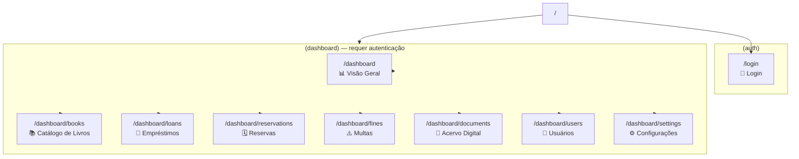
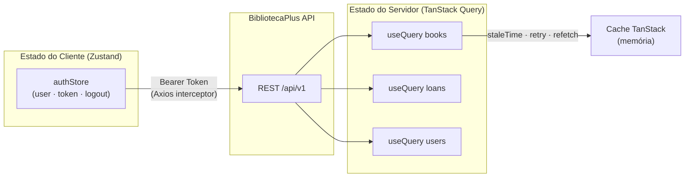
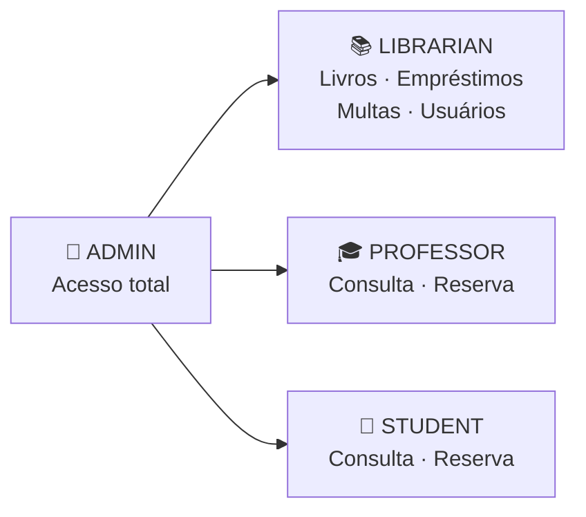

# BibliotecaPlus Monitor

Painel administrativo web da plataforma BibliotecaPlus — Next.js 15 + Shadcn/UI.

## Stack

- **Framework**: Next.js 15 (App Router)
- **UI**: TailwindCSS + Shadcn/UI + Radix UI
- **Estado servidor**: TanStack Query v5
- **Estado cliente**: Zustand
- **Forms**: React Hook Form + Zod
- **HTTP**: Axios com interceptors JWT

---

## Estrutura de Páginas



---

## Fluxo de Estado



---

## RBAC — Controle por Papel



---

## Início Rápido

```bash
# 1. Variáveis de ambiente
echo "NEXT_PUBLIC_API_URL=http://localhost:4000/api/v1" > .env.local

# 2. Instalar e rodar
npm install
npm run dev
# → http://localhost:3000
```

## Credenciais de Teste

| Usuário | Email | Senha | Papel |
|---------|-------|-------|-------|
| Admin | admin@biblioteca.com | Senha@123 | ADMIN |
| Bibliotecário | bibliotecario@biblioteca.com | Senha@123 | LIBRARIAN |
| Professor | prof@biblioteca.com | Senha@123 | PROFESSOR |
| Aluno | aluno@biblioteca.com | Senha@123 | STUDENT |
